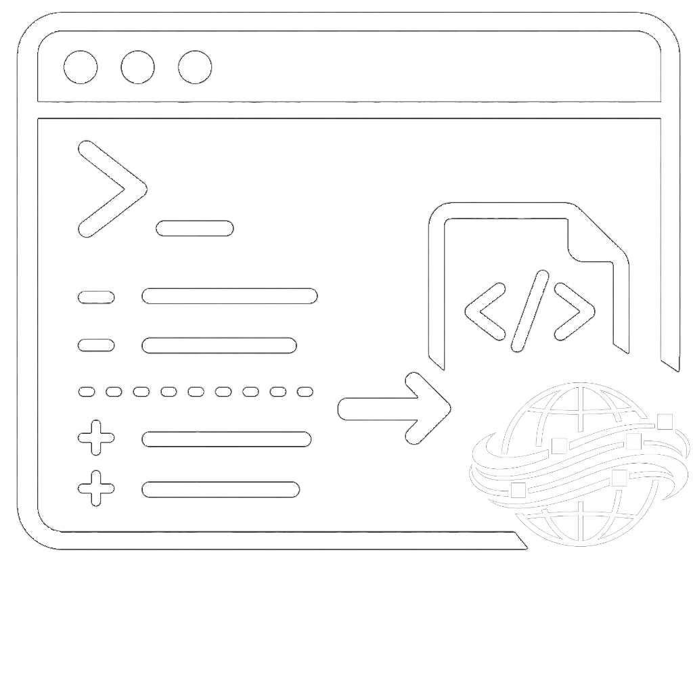

# Project Assets

Public visual asset library supporting the documentation, demonstration, and presentation of personal software, data, automation, and infrastructure projects.

This repository centralizes screenshots, logos, icons, editable image sources, generated media, and reusable visual references that may be consumed by project READMEs and other technical documentation.

It is intended for documentation and showcase material. It should not be treated as a production CDN or as a runtime dependency of the projects represented here.

## Contents

The repository may contain:

- application and desktop icons;
- project logos and branding exports;
- raw, annotated, and publication-ready screenshots;
- editable GIMP sources;
- AI-generated visual drafts and selected outputs;
- reusable templates and references;
- legacy assets retained for historical purposes;
- utility scripts for validation, conversion, or export workflows.

## Repository structure

```text
global/
  archive/       Historical and legacy material.
  gimp/          Reusable editable GIMP sources.
  icons/         Icons shared across multiple projects.
  logos/         Logos shared across multiple projects.
  references/    Shared visual references.
  templates/     Reusable visual templates.
  wallpapers/    Shared wallpaper assets.

projects/
  atlas-dataflow/
  debian-bootstrap/
  n8n-local-stack/
  sic-core/

scripts/         Utilities reserved for asset validation and processing.
```

Assets under `global/` are reusable across projects. Assets under `projects/` belong to a specific project and should not be assumed to be generic.

Each project may use the following structure:

```text
<project>/
  app-icons/
    source/
    exports/
    ico/
    png/
    svg/
  desktop-icons/
    source/
    exports/
    ico/
    png/
    svg/
  generated/
    prompts/
    raw/
    selected/
  logos/
    source/
    exports/
    png/
    svg/
  screenshots/
    raw/
    annotated/
    exports/
  references/
  archive/
```

Not every project uses every category. Empty directories may be retained with `.gitkeep` files to preserve the intended organization.

## Asset lifecycle

The directory names describe the intended state of an asset:

| Directory | Purpose |
| --- | --- |
| `source/` | Editable source files used to produce final assets. |
| `raw/` | Original or unprocessed captures and generated outputs. |
| `selected/` | Generated variants selected for further use or refinement. |
| `annotated/` | Screenshots containing callouts, labels, or explanatory marks. |
| `exports/` | Final assets prepared for documentation or distribution. |
| `archive/` | Historical, superseded, experimental, or retired material. |

Whenever practical, documentation should reference a stable file from an active project directory rather than an item stored under `archive/`.

## Using an asset

From this repository, use a relative path:

```markdown

```

From another GitHub repository, such as a project README, use the raw file URL:

```markdown

```

A URL that points to `main` follows the latest version of the asset. Documentation that must remain reproducible for a specific release should pin the URL to a tag or commit instead.

## Naming conventions

New and actively maintained assets should follow these conventions:

- use lowercase `kebab-case` names;
- use lowercase file extensions;
- avoid spaces, accents, UUIDs, and ambiguous abbreviations;
- describe the asset by purpose rather than by editing state;
- avoid temporary names such as `new`, `test`, `final`, or `final-2`;
- add meaningful qualifiers when needed, such as viewport, theme, or variant;
- keep the path stable after it is referenced by external documentation.

Examples:

```text
public-home-desktop.webp
dataset-detail-overview.webp
dataset-detail-forecasting-dark.webp
atlas-dataflow-app-icon.svg
```

Legacy files under `archive/` may retain their original names to preserve historical context and existing references.

## Format guidance

- Prefer **WebP** for optimized screenshots and other photographic or interface imagery.
- Use **PNG** when lossless rendering or transparency is important.
- Use **SVG** as the canonical format for scalable logos and icons when available.
- Use **ICO** only for platforms or integrations that require it.
- Use animated **GIFs** sparingly and optimize them before publication.
- Keep editable files such as **XCF** in `source/` or `gimp/` directories.
- Avoid committing multiple exports that serve the same purpose without a documented reason.

Before publishing an asset, verify that it is legible at its intended display size and that its file size is appropriate for README or documentation use.

## Privacy and metadata

Screenshots and exported media must be reviewed before publication. They should not expose:

- credentials, tokens, cookies, or authorization headers;
- personal or confidential data;
- internal hostnames, private IP addresses, or local filesystem paths;
- sensitive run identifiers, administrative information, or debugging output;
- metadata that reveals information not intended for publication.

When possible, remove unnecessary EXIF, XMP, comments, and editor-specific metadata from publication-ready exports while preserving required color profiles.

## Rights, attribution, and third-party marks

This repository contains a mixture of original project media, generated imagery, screenshots, and third-party names or logos.

Third-party product names, logos, and trademarks remain the property of their respective owners. Their inclusion is for identification, documentation, or demonstration and does not imply sponsorship, endorsement, or affiliation.

Public availability of this repository does not grant unrestricted reuse of every file. Unless an asset or directory provides an explicit license, verify its origin and applicable terms before redistributing or adapting it. Project source-code licenses do not automatically apply to visual media stored here.

When adding externally sourced or generated material, preserve any required attribution and record its origin, applicable license, and usage restrictions alongside the asset or in the relevant project documentation.

## Maintenance

Assets evolve with the projects they support. Existing external references should be considered before moving, renaming, replacing, or removing a published file.

Historical material may remain available under `archive/`, but active documentation should prefer curated and publication-ready assets from the corresponding project directories.
